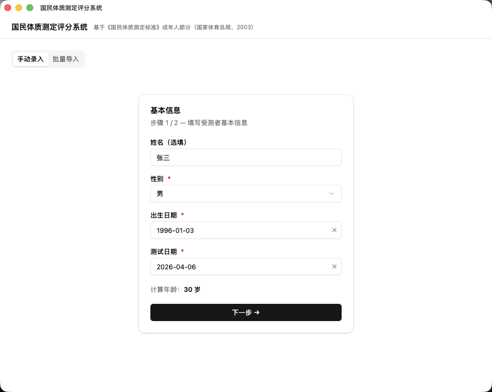
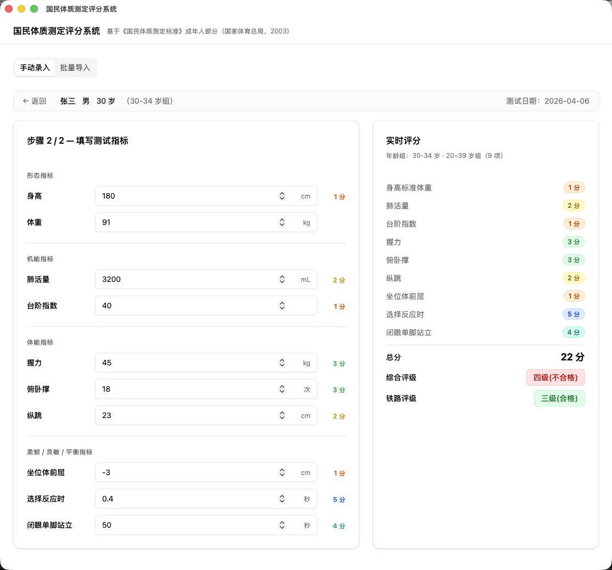
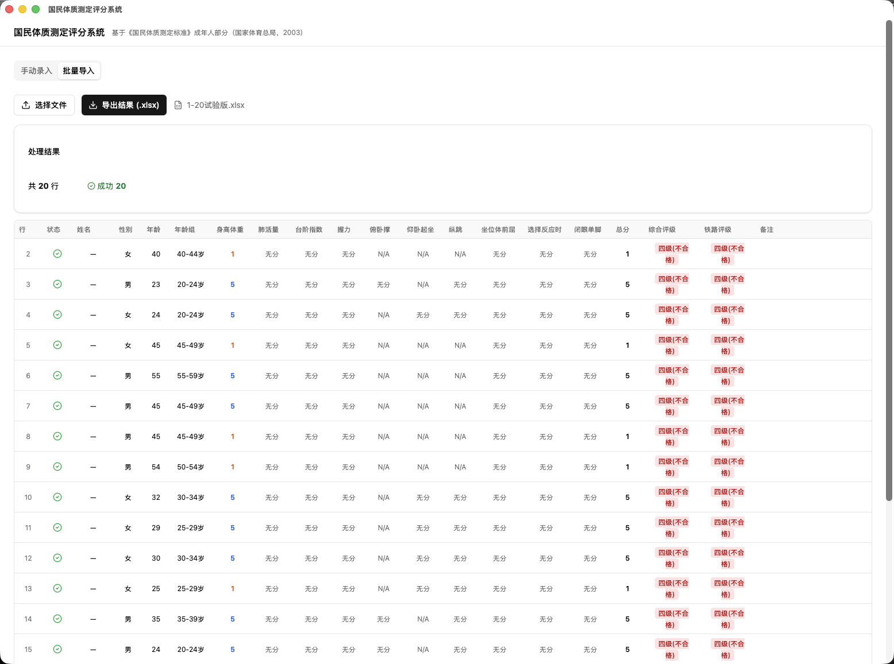

# Fitness Scorer

[](https://github.com/LilMikey-CN/fitness-scorer/actions/workflows/build-windows.yml)


A desktop application for scoring physical fitness assessments based on the [*National Physical Fitness Standards (Adult Section)*](http://www.sport.gov.cn/) published by China's General Administration of Sport (2003). It evaluates 10 standardized metrics across gender and age groups (20–59), producing individual scores and composite grades.

> **[中文版本](#中文版本)** is available below.

### Manual Entry

<p align="center">
  
  <br/>
  <em>Step 1: Enter basic information</em>
</p>

<p align="center">
  
  <br/>
  <em>Step 2: Fill in metrics with real-time scoring</em>
</p>

### Batch Import

<p align="center">
  
  <br/>
  <em>Upload, preview, and export scored results</em>
</p>

---

## Features

- **Manual Entry** — Step-by-step form: enter basic info (gender, birth date, test date), then fill in metrics with real-time scoring feedback
- **Batch Import** — Upload Excel (`.xlsx`, `.xls`) or CSV files, process hundreds of records at once, and export scored results to `.xlsx`
- **Offline & Private** — All computation happens locally in the browser engine; no data leaves the device
- **Accurate Scoring** — Implements the full national standard with floating-point precision handling, age-group thresholds, and conditional metrics
- **Error-Tolerant Batch Processing** — Invalid rows are flagged with error messages without interrupting the rest of the batch
- **Cross-Platform Development** — Developed on macOS, targets Windows 10/11 via GitHub Actions CI

---

## Tech Stack

| Layer | Technology |
|-------|-----------|
| Desktop Shell | [Tauri v2](https://v2.tauri.app/) |
| Frontend | React 18 + TypeScript |
| UI Components | [shadcn/ui](https://ui.shadcn.com/) + [Radix UI](https://www.radix-ui.com/) |
| Styling | Tailwind CSS v4 |
| Data Tables | TanStack Table v8 |
| Forms & Validation | React Hook Form + Zod |
| Excel/CSV I/O | [SheetJS](https://sheetjs.com/) (xlsx) |
| Build Tool | Vite 7 |
| CI/CD | GitHub Actions (Windows runner) |

---

## Getting Started

### Prerequisites

| Tool | Version |
|------|---------|
| [Node.js](https://nodejs.org/) | 20+ |
| [pnpm](https://pnpm.io/) | 9+ |
| [Rust](https://www.rust-lang.org/tools/install) | stable |

### Installation

```bash
git clone https://github.com/LilMikey-CN/fitness-scorer.git
cd fitness-scorer
pnpm install
```

### Development

```bash
# Frontend only (no Tauri shell, opens in browser)
pnpm dev

# Full desktop app (Tauri + frontend)
pnpm tauri dev

# Type checking
pnpm typecheck
```

The dev server runs on `http://localhost:1420`.

---

## Usage

### Manual Entry

1. **Basic Info** — Select gender, enter birth date and test date. Age is calculated automatically.
2. **Metrics Input** — Fill in available measurements (height, weight, lung capacity, etc.). The form dynamically shows only the metrics applicable to the person's age and gender.
3. **Real-Time Scoring** — Each metric is scored (0–5) as you type. A side panel displays all scores, the total, and the composite grade.

### Batch Import

1. Click the **Batch Import** tab.
2. Select an Excel or CSV file. The system auto-detects encoding (UTF-8 / GBK).
3. Preview parsed data — rows with errors are highlighted in red.
4. Click **Export** to save scored results as `.xlsx`.

#### Input File Format

The first row must be a header. Column names are **case-insensitive** and support both Chinese and English:

| Required | Column Name | Aliases |
|----------|------------|---------|
| Yes | 性别 | `gender`, `sex` — values: `1/男/M` (male), `0/女/F` (female) |
| Yes | 年龄 | `age` — or provide `出生年`/`birth_year` instead |
| Yes | 身高 | `height` — in cm |
| Yes | 体重 | `weight` — in kg |

All 10 measurement columns (lung capacity, step index, grip strength, etc.) are optional. See [`docs/batch-schema.md`](docs/batch-schema.md) for the full specification and a CSV example.

---

## Scoring Standard

Based on the 2003 national standard for adults aged 20–59.

### Metrics (10 total)

| Category | Metrics |
|----------|---------|
| Morphology | Height-weight index (special 1/3/5 scoring) |
| Organ Function | Lung capacity, Step test index |
| Physical Fitness | Grip strength, Push-ups (male 20–39), Sit-ups (female 20–39), Vertical jump (20–39 only) |
| Flexibility & Balance | Sit-and-reach, Reaction time, Single-leg stance |

### Scoring

- Each metric: **0–5 points** (height-weight: only 1, 3, or 5)
- Lookup tables are gender-specific and divided into 5-year age bands

### Composite Grading

| Age Group | Excellent | Good | Pass | Fail |
|-----------|-----------|------|------|------|
| 20–39 | > 33 | 30–33 | 23–29 | < 23 |
| 40–59 | > 26 | 24–26 | 18–23 | < 18 |

If any applicable metric scores **0**, no composite grade is assigned.

---

## Project Structure

```
fitness-scorer/
├── src/
│   ├── App.tsx                    # Tab router (Manual Entry / Batch Import)
│   ├── data/
│   │   └── scoringTables.ts       # All scoring lookup tables (national standard)
│   ├── lib/
│   │   ├── scorer.ts              # Core scoring engine
│   │   ├── batchProcessor.ts      # Excel/CSV batch processing
│   │   └── validators.ts          # Zod input validation schemas
│   ├── components/
│   │   ├── ManualEntry/           # Step-by-step manual input UI
│   │   ├── BatchImport/           # File upload, preview, and export UI
│   │   └── ui/                    # shadcn/ui primitives
│   └── types/
│       └── index.ts               # TypeScript interfaces & type definitions
├── src-tauri/                     # Tauri backend shell (minimal Rust)
├── docs/
│   ├── PRD.md                     # Product requirements document
│   └── batch-schema.md            # Batch file format specification
└── .github/workflows/
    └── build-windows.yml          # CI: build .msi + .exe on Windows
```

---

## Building for Production

Production builds run on **GitHub Actions** (Windows runner), triggered by pushing a version tag:

```bash
git tag v1.0.0
git push origin v1.0.0
```

The workflow produces two installer formats:
- **MSI** — `src-tauri/target/release/bundle/msi/*.msi`
- **EXE (NSIS)** — `src-tauri/target/release/bundle/nsis/*.exe`

Artifacts are uploaded to the GitHub Actions run and can be downloaded from the **Actions** tab.

---

## Contributing

1. Fork the repository
2. Create a feature branch (`git checkout -b feature/my-feature`)
3. Commit your changes
4. Push to the branch and open a Pull Request

Please ensure `pnpm typecheck` passes before submitting.

---

## License

This project is proprietary. All rights reserved.

---

---

<a id="中文版本"></a>

# 国民体质测定评分系统

[](https://github.com/LilMikey-CN/fitness-scorer/actions/workflows/build-windows.yml)


基于[《国民体质测定标准》（成年人部分）](http://www.sport.gov.cn/)（国家体育总局，2003 年发布）开发的桌面评分应用。支持对 20–59 岁成年人的 10 项体质指标进行逐项评分与综合评级。

### 手动录入

<p align="center">
  
  <br/>
  <em>步骤 1：填写基本信息</em>
</p>

<p align="center">
  
  <br/>
  <em>步骤 2：录入指标，实时查看评分</em>
</p>

### 批量导入

<p align="center">
  
  <br/>
  <em>上传文件、预览数据、导出评分结果</em>
</p>

---

## 功能特性

- **手动录入** — 分步表单：先输入基本信息（性别、出生日期、测试日期），再逐项填写指标，实时显示各项得分与综合评级
- **批量导入** — 上传 Excel（`.xlsx`、`.xls`）或 CSV 文件，一次性处理数百条记录，结果导出为 `.xlsx`
- **离线运行** — 所有计算在本地完成，数据不会离开设备
- **精确评分** — 完整实现国家标准，含浮点精度处理、年龄分组阈值、条件适用指标
- **容错批处理** — 无效行标注错误信息，不中断整体处理
- **跨平台开发** — macOS 开发，通过 GitHub Actions CI 构建 Windows 安装包

---

## 技术栈

| 层级 | 技术 |
|------|------|
| 桌面外壳 | [Tauri v2](https://v2.tauri.app/) |
| 前端 | React 18 + TypeScript |
| UI 组件 | [shadcn/ui](https://ui.shadcn.com/) + [Radix UI](https://www.radix-ui.com/) |
| 样式 | Tailwind CSS v4 |
| 数据表格 | TanStack Table v8 |
| 表单校验 | React Hook Form + Zod |
| Excel/CSV 读写 | [SheetJS](https://sheetjs.com/)（xlsx） |
| 构建工具 | Vite 7 |
| CI/CD | GitHub Actions（Windows runner） |

---

## 快速开始

### 环境要求

| 工具 | 版本 |
|------|------|
| [Node.js](https://nodejs.org/) | 20+ |
| [pnpm](https://pnpm.io/) | 9+ |
| [Rust](https://www.rust-lang.org/tools/install) | stable |

### 安装

```bash
git clone https://github.com/LilMikey-CN/fitness-scorer.git
cd fitness-scorer
pnpm install
```

### 开发

```bash
# 仅前端（无 Tauri 外壳，浏览器打开）
pnpm dev

# 完整桌面应用（Tauri + 前端）
pnpm tauri dev

# 类型检查
pnpm typecheck
```

开发服务器地址：`http://localhost:1420`

---

## 使用说明

### 手动录入

1. **基本信息** — 选择性别，输入出生日期和测试日期，系统自动计算周岁年龄。
2. **指标录入** — 填写各项测量值（身高、体重、肺活量等）。表单根据年龄和性别动态显示适用指标。
3. **实时评分** — 每输入一项即刻显示该项得分（0–5 分），侧边面板汇总所有得分、总分及综合评级。

### 批量导入

1. 点击**批量导入**标签页。
2. 选择 Excel 或 CSV 文件，系统自动识别编码（UTF-8 / GBK）。
3. 预览解析结果——出错的行以红色高亮。
4. 点击**导出**，将评分结果保存为 `.xlsx` 文件。

#### 输入文件格式

首行为表头，列名**不区分大小写**，支持中英文：

| 必填 | 列名 | 英文别名 |
|------|------|----------|
| 是 | 性别 | `gender`、`sex` — 取值：`1/男/M`（男）、`0/女/F`（女） |
| 是 | 年龄 | `age` — 或提供 `出生年`/`birth_year` 替代 |
| 是 | 身高 | `height` — 单位 cm |
| 是 | 体重 | `weight` — 单位 kg |

其余 10 项测量指标均为可选。完整规范及 CSV 示例见 [`docs/batch-schema.md`](docs/batch-schema.md)。

---

## 评分标准

依据 2003 年国家标准，适用年龄 20–59 岁。

### 测试指标（共 10 项）

| 类别 | 指标 |
|------|------|
| 形态指标 | 身高体重指数（特殊 1/3/5 赋分） |
| 机能指标 | 肺活量、台阶指数 |
| 体能指标 | 握力、俯卧撑（男 20–39）、仰卧起坐（女 20–39）、纵跳（仅 20–39） |
| 柔韧灵敏平衡 | 坐位体前屈、选择反应时、闭眼单脚站立 |

### 评分规则

- 每项指标：**0–5 分**（身高体重仅 1、3、5 三档）
- 查分表按性别和 5 岁年龄段划分

### 综合评级

| 年龄段 | 一级（优秀） | 二级（良好） | 三级（合格） | 四级（不合格） |
|--------|------------|------------|------------|--------------|
| 20–39 岁 | > 33 | 30–33 | 23–29 | < 23 |
| 40–59 岁 | > 26 | 24–26 | 18–23 | < 18 |

若任一适用指标得分为 **0（无分）**，则不评定综合等级。

---

## 项目结构

```
fitness-scorer/
├── src/
│   ├── App.tsx                    # 标签路由（手动录入 / 批量导入）
│   ├── data/
│   │   └── scoringTables.ts       # 所有评分查找表（国家标准数据）
│   ├── lib/
│   │   ├── scorer.ts              # 核心评分引擎
│   │   ├── batchProcessor.ts      # Excel/CSV 批量处理
│   │   └── validators.ts          # Zod 输入校验
│   ├── components/
│   │   ├── ManualEntry/           # 手动录入界面
│   │   ├── BatchImport/           # 批量导入界面
│   │   └── ui/                    # shadcn/ui 基础组件
│   └── types/
│       └── index.ts               # TypeScript 类型定义
├── src-tauri/                     # Tauri 后端外壳（最小化 Rust）
├── docs/
│   ├── PRD.md                     # 产品需求文档
│   └── batch-schema.md            # 批量文件字段规范
└── .github/workflows/
    └── build-windows.yml          # CI：Windows 构建 .msi + .exe
```

---

## 生产构建

生产构建通过 **GitHub Actions**（Windows runner）执行，推送版本标签即触发：

```bash
git tag v1.0.0
git push origin v1.0.0
```

构建产物：
- **MSI 安装包** — `src-tauri/target/release/bundle/msi/*.msi`
- **EXE 安装包（NSIS）** — `src-tauri/target/release/bundle/nsis/*.exe`

构建完成后可在 GitHub 仓库的 **Actions** 标签页下载安装文件。

---

## 参与贡献

1. Fork 本仓库
2. 创建功能分支（`git checkout -b feature/my-feature`）
3. 提交更改
4. 推送并创建 Pull Request

提交前请确保 `pnpm typecheck` 通过。

---

## 许可证

本项目为私有项目，保留所有权利。
